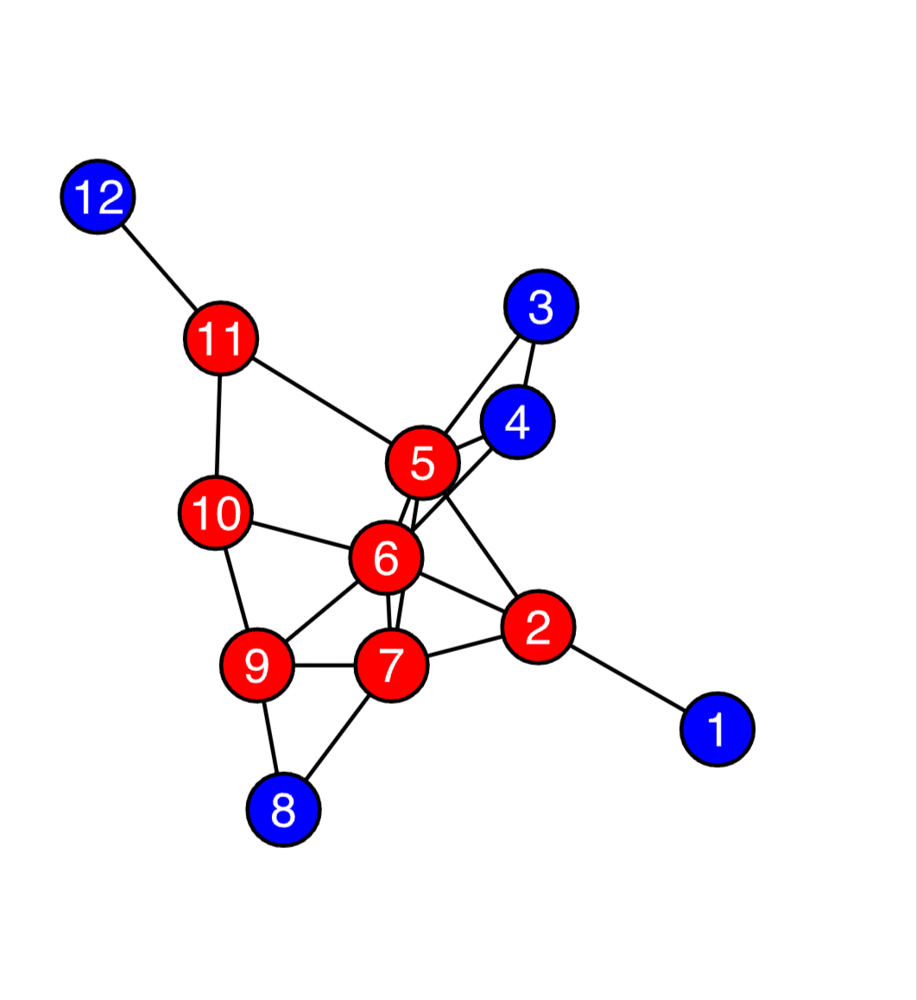
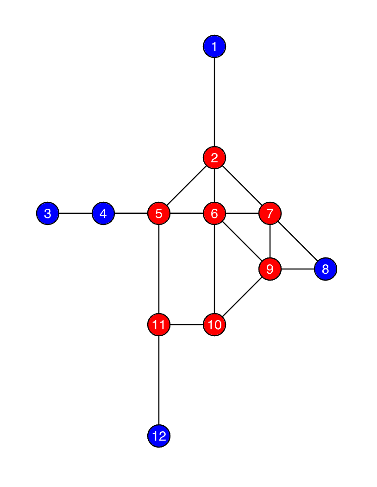
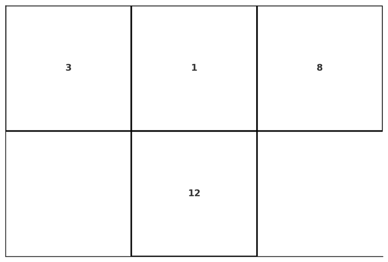
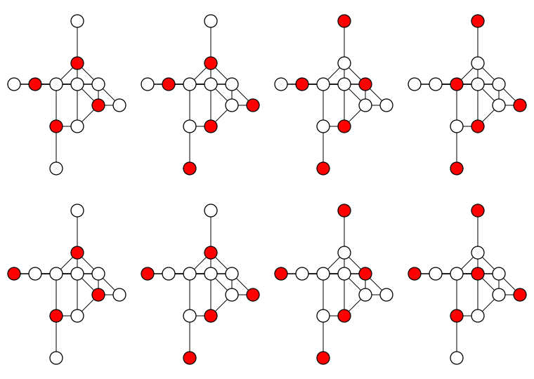
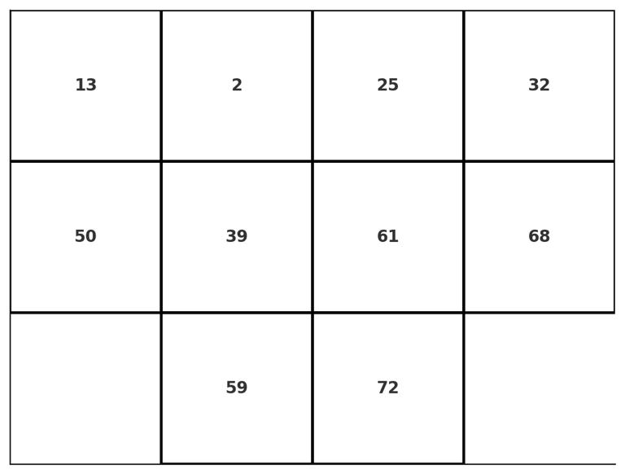

## Elementary cellular automaton[^wiki-1d-automaton]

An elementary cellular automaton is a 1-dimensional cellular automaton where there are two possible states (labeled by 0 and 1). The rule to determine the state of the cell in next generation depends only on the current state of the cell and its two immediate neighbors.

There are $8 = 2^3$ possible configurations for a cell and its two immediate neighbors. Different elementary cellular automaton are only different from their translation rules. There are only $2^8 = 256$ different rules, so do the automatons.

If we put each possible current configurations in order: 111, 110, ..., 001, 000, and put the resulting state under them. We then get an integer in its binary representations. Then this integer is taken to be the rule number of the automaton. For example, rule 110.

Given that $110_d = 01101110_2$, so rule 110 is defined by the translation rule:

|Current Pattern (L, C, R)| 111 | 110 | 101 | 100 | 011 | 010 | 001 | 000 |
| :------- |:-------:|:-------:|:-------:|:-------:|:-------:|:-------:|:-------:|:-------:|
| New State For Center Cell | 0 | 1 | 1 | 0 | 1 | 1 | 1 | 0 |

## Turing Complete

Rule 110 has been shown to be Turing Complete[^Cook2009], and thus capable of universal computation.

## Rule 110 Gadget

We can encode the Rule 110 cellular automaton into a Weighted Maximum Independent Set Problem, with blue vertices assigned a weight of 1 and red vertices assigned a weight of 2, as follows.

This graph can be embedded into a grid graph, where two vertices are connected if and only if their Euclidean distance is no more than $\sqrt{5}$.

The correspondence between the Maximum Weighted Independent Set (MWIS) Solution and Rule 110 is as follows: 

The states of vertex **1**, vertex **3**, and vertex **8** represent the states of the **middle**, **left**, and **right** cells of the automaton **input**, respectively. If the input value of a cell is 1, then the corresponding vertex must be in the MWIS solution; otherwise, it is not. Vertex **12** corresponds to the automaton **output. If the automaton output is 1, then vertex 12 is in the MWIS solution; otherwise, it is not.

In the automaton diagram, the above gadget is equivalent to:

There are exactly **8** different MWIS solutions in this graph (the weighted size of each MWIS solution is 7), each corresponding to one of the **8** possible outputs of the automaton. We list them as follows.

## Surface Programmable Material

The gadget we constructed based on the Rule 110 cellular automaton naturally possesses Turing completeness. Therefore, it can be tiled in a two-dimensional plane to create a computational material with logical operation capabilities. Utilizing copy gadget and cross gadget[^Nguyen2023], we construct a **Surface Programmable Material** with open boundary conditions as follows.

The above gadget depicts a two-layer cellular automaton. The vertices in blue, red, green and black have weights of 1, 2, 3 and 4, respectively. In the automaton diagram, the above gadget is equivalent to:

One can easily verify that with this lattice-like structure, we can build infinitely large gadgets capable of universal computing in a surface. Thus we call it Surface Programmable Material.
## References

[^wiki-1d-automaton]: https://en.wikipedia.org/wiki/Elementary_cellular_automaton 

[^Cook2009]: Cook, M. (2009). A Concrete View of Rule 110 Computation. Electronic Proceedings in Theoretical Computer Science, 1, 31–55. https://doi.org/10.4204/EPTCS.1.4 

[^Nguyen2023]: Nguyen, M.-T., Liu, J.-G., Wurtz, J., Lukin, M. D., Wang, S.-T., & Pichler, H. (2023). Quantum Optimization with Arbitrary Connectivity Using Rydberg Atom Arrays. PRX Quantum, 4(1), 010316. https://doi.org/10.1103/PRXQuantum.4.010316

