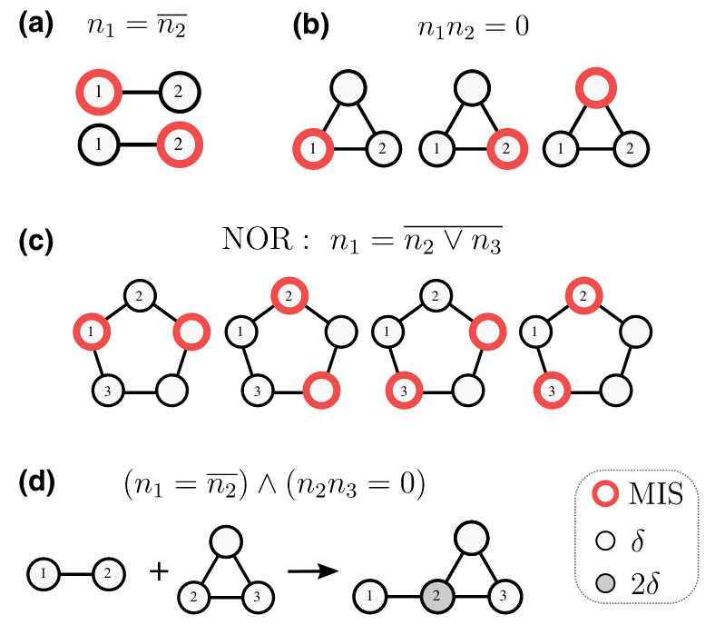
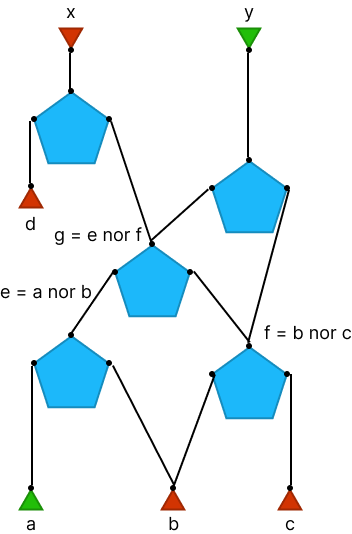

# Computational dynamics of Rydberg atoms

## Rydberg atoms - the classical logic gates

**Statement 1**: The classical part of Rydberg Hamiltonian encodes an independent set problem.

The Rydberg Hamiltonian[^Nguyen2023] is defined as
```math
    H_{\text{Ryd}} = \sum_v \dfrac{\Omega_v}{2} \sigma^x_v - \sum_v \Delta_v n_v + \sum_{v < w}  V_{\text{Ryd}}(|\overrightarrow{\mathbf{r}_v} - \overrightarrow{\mathbf{r}_w}|)n_v n_w.
```
where $\Omega_v$ is the Rabi frequency, $\Delta_v$ is the detuning, $n_v = \dfrac{1}{2}(1 - \sigma^z_v)$ is the number operator, and $V_{\text{Ryd}}(|\overrightarrow{\mathbf{r}_v} - \overrightarrow{\mathbf{r}_w}|) = C_6/|\overrightarrow{\mathbf{r}_v} - \overrightarrow{\mathbf{r}_w}|^6$ is the Rydberg interaction potential.

The classical part of which can be written as
```math
H_\text{MWIS} = -\sum_{v \in V}\delta_v n_v + \sum_{(u, v) \in E} U_{uv} n_u n_v.
```
The ground state of which encodes the maximum weight independent set (MWIS) problem.

> Wikipedia: In graph theory, a maximal independent set (MIS) or maximal stable set is an independent set that is not a subset of any other independent set. In other words, there is no vertex outside the independent set that may join it because it is maximal with respect to the independent set property.

**Statement 2**: Finding the ground state of the classical part of the Rydberg Hamiltonian is equivalent to finding the maximum weight independent set.

## Independent set gadgets
**Statement 3**: The classical Rydberg Hamiltonian is universal for classical computation.

The NOR gate can be implemented using the Rydberg Hamiltonian (subfigure c below). The NOR gate is a universal gate for classical computation.
{width=70%}

The conjunction of gates can be implemented by "gluing" the Rydberg atoms together (subfigure d below). The weights are added together.

For more logic gates, please check the GitHub repository [UnitDiskMapping.jl](https://github.com/QuEraComputing/UnitDiskMapping.jl/blob/main/test/logicgates.jl).

## Cooling

**Statement 4**: The Rydberg Hamiltonian, if cooled successfully with some vertices fixed to certain configuration, can be used to solve the circuit satisfiability problem, which is NP-complete.[^Moore2011]

Given a random initial state, the Rydberg atoms can be cooled to the ground state of the classical part of the Rydberg Hamiltonian. By fixing the configurations of some nodes, the ground state of the classical part of the Rydberg Hamiltonian encodes the solution to the encoded circuit. To fix the configurations of some nodes, we just remove some atoms from the system.

**Hypothesis**: Cooling is easy if the process is from the deterministic direction, hard if the process is from the non-deterministic direction.

The deterministic direction is the direction how computation is done in the classical computer. The non-deterministic direction is the direction that the next computational step is not completely determined by the current state, e.g. the integer factoring problem:

> Wikipedia: In number theory, integer factorization is the decomposition of a positive integer into a product of integers.

**Proposed experiment**: To test the hypothesis, we can compare the cooling time of the Rydberg atoms when the cooling process is done from the deterministic direction and when the cooling process is done from the non-deterministic direction.

In the following example of NOR gate network, the deterministic direction is from bottom to top
```math
\begin{align*}
e = &\text{NOR}(a, b)\\
f = &\text{NOR}(b, c)\\
g = &\text{NOR}(e, f)\\
x = &\text{NOR}(d, g)\\
y = &\text{NOR}(g, f)
\end{align*}
```
and the non-deterministic direction is from top to bottom.



We should observe the following results: If the cold source is from top to bottom, the cooling time is longer than if the cold source is from bottom to top.

## References
[^Nguyen2023]: Nguyen, Minh-Thi, et al. "Quantum optimization with arbitrary connectivity using Rydberg atom arrays." PRX Quantum 4.1 (2023): 010316.
[^Moore2011]: Moore, Cristopher, and Stephan Mertens. The nature of computation. OUP Oxford, 2011.
