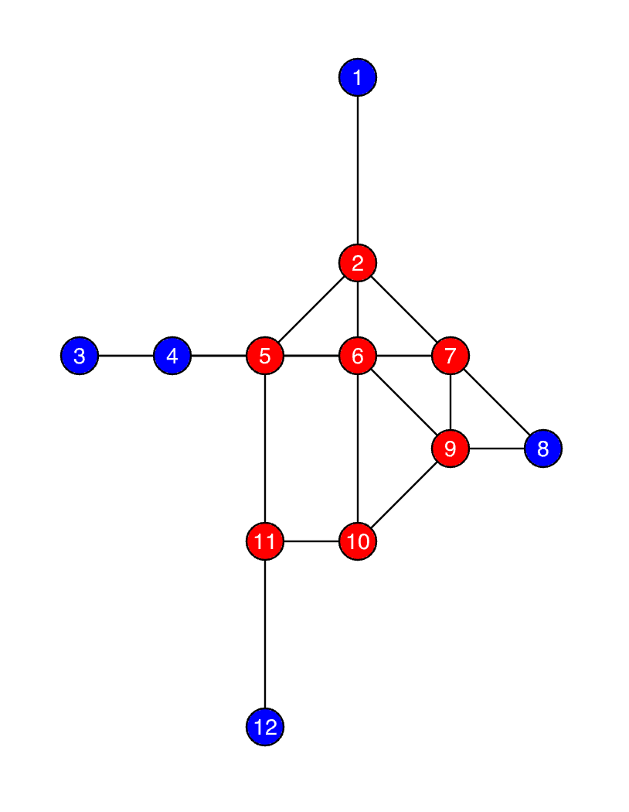
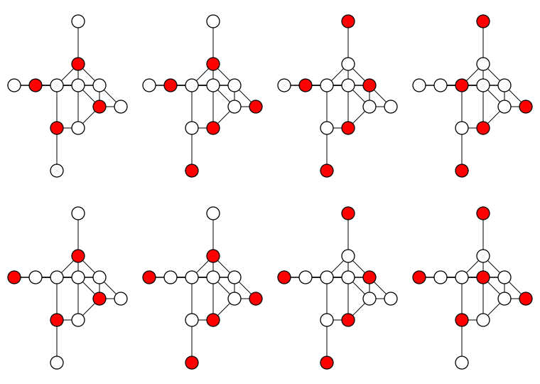
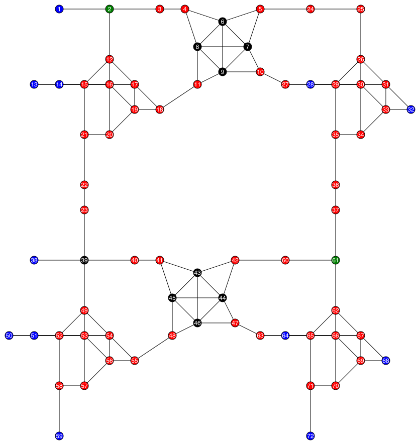
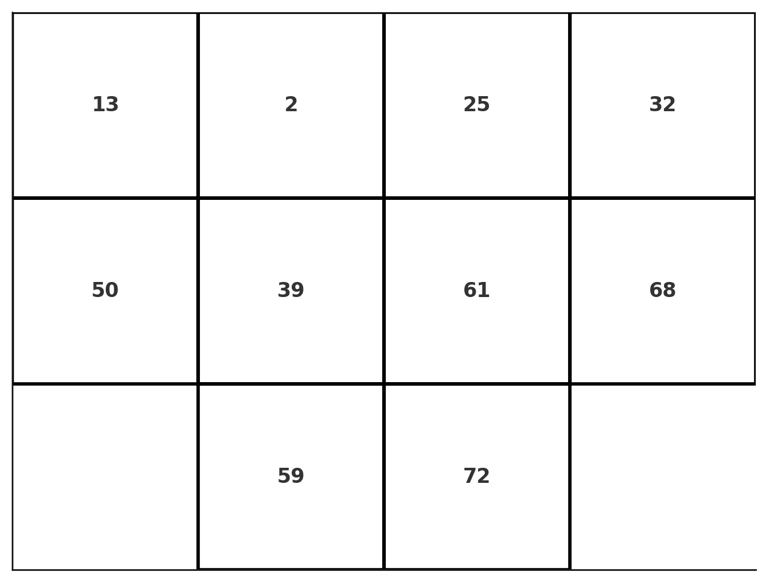

# Surface Programmable Materials

## Physical model: Rydberg atoms array

**Statement 1**: The classical part of Rydberg Hamiltonian encodes an independent set problem.

The Rydberg Hamiltonian[^Nguyen2023] is defined as
```math
    H_{\text{Ryd}} = \sum_v \dfrac{\Omega_v}{2} \sigma^x_v - \sum_v \Delta_v n_v + \sum_{v < w}  V_{\text{Ryd}}(|\overrightarrow{\mathbf{r}_v} - \overrightarrow{\mathbf{r}_w}|)n_v n_w.
```
where $\Omega_v$ is the Rabi frequency, $\Delta_v$ is the detuning, $n_v = \dfrac{1}{2}(1 - \sigma^z_v)$ is the number operator, and $V_{\text{Ryd}}(|\overrightarrow{\mathbf{r}_v} - \overrightarrow{\mathbf{r}_w}|) = C_6/|\overrightarrow{\mathbf{r}_v} - \overrightarrow{\mathbf{r}_w}|^6$ is the Rydberg interaction potential.

The classical part of which can be written as
```math
H_\text{MWIS} = -\sum_{v \in V}\delta_v n_v + \sum_{(u, v) \in E} U_{uv} n_u n_v.
```
The ground state of which encodes the maximum weight independent set (MWIS) problem.

> Wikipedia: In graph theory, a maximal independent set (MIS) or maximal stable set is an independent set that is not a subset of any other independent set. In other words, there is no vertex outside the independent set that may join it because it is maximal with respect to the independent set property.

**Statement 2**: Finding the ground state of the classical part of the Rydberg Hamiltonian is equivalent to finding the maximum weight independent set.

### Energy based universal computation with Rydberg atoms array
**Statement 3**: The classical Rydberg Hamiltonian is universal for classical computation.

The NOR gate can be implemented using the Rydberg Hamiltonian (subfigure c below). The NOR gate is a universal gate for classical computation.
{width=300}

The conjunction of gates can be implemented by "gluing" the Rydberg atoms together (subfigure d below). The weights are added together.

For more logic gates, please check the GitHub repository [UnitDiskMapping.jl](https://github.com/QuEraComputing/UnitDiskMapping.jl/blob/main/test/logicgates.jl).

### Cooling the Rydberg Hamiltonian

**Statement 4**: The Rydberg Hamiltonian, if cooled successfully with some vertices fixed to certain configuration, can be used to solve the circuit satisfiability problem, which is NP-complete.[^Moore2011]

$P \neq NP$: Cooling is generally hard, especially when from the non-deterministic direction.

## Surface Programmable Material

**Definition: (Surface programmable material)**: a lattice (with translational invariance) model that can be programmed on its surfaces to perform universal computation.

### Elementary cellular automaton

An elementary cellular automaton is a 1-dimensional cellular automaton[^wiki-1d-automaton] where there are two possible states (labeled by 0 and 1). The rule to determine the state of the cell in next generation depends only on the current state of the cell and its two immediate neighbors.

There are $8 = 2^3$ possible configurations for a cell and its two immediate neighbors. Different elementary cellular automaton are only different from their translation rules. There are only $2^8 = 256$ different rules, so do the automatons.

If we put each possible current configurations in order: 111, 110, ..., 001, 000, and put the resulting state under them. We then get an integer in its binary representations. Then this integer is taken to be the rule number of the automaton. For example, rule 110.

Given that $110_d = 01101110_2$, so rule 110 is defined by the translation rule:


|Current Pattern (L, C, R)| 111 | 110 | 101 | 100 | 011 | 010 | 001 | 000 |
| :------- |:-------:|:-------:|:-------:|:-------:|:-------:|:-------:|:-------:|:-------:|
| New State For Center Cell | 0 | 1 | 1 | 0 | 1 | 1 | 1 | 0 |

Rule 110 has been shown to be Turing Complete[^Cook2009], and thus capable of universal computation.

### The Rule 110 Gadget

We can encode the Rule 110 cellular automaton into a Weighted Maximum Independent Set Problem, with blue vertices assigned a weight of 1 and red vertices assigned a weight of 2, as follows.
{width=300}

This graph can be embedded into a grid graph, where two vertices are connected if and only if their Euclidean distance is no more than $\sqrt{5}$.
{width=300}

The correspondence between the Maximum Weighted Independent Set (MWIS) Solution and Rule 110 is as follows: 

The states of vertex **1**, vertex **3**, and vertex **8** represent the states of the **middle**, **left**, and **right** cells of the automaton **input**, respectively. If the input value of a cell is 1, then the corresponding vertex must be in the MWIS solution; otherwise, it is not. Vertex **12** corresponds to the automaton **output. If the automaton output is 1, then vertex 12 is in the MWIS solution; otherwise, it is not.

In the automaton diagram, the above gadget is equivalent to:

{width=300}

There are exactly **8** different MWIS solutions in this graph (the weighted size of each MWIS solution is 7), each corresponding to one of the **8** possible outputs of the automaton. We list them as follows.
{width=500}

### A 2D Surface Programmable Material

The gadget we constructed based on the Rule 110 cellular automaton naturally possesses Turing completeness. Therefore, it can be tiled in a two-dimensional plane to create a computational material with logical operation capabilities. Utilizing copy gadget and cross gadget[^Nguyen2023], we construct a **Surface Programmable Material** with open boundary conditions as follows.

{width=500}

The above gadget depicts a two-layer cellular automaton. The vertices in blue, red, green and black have weights of 1, 2, 3 and 4, respectively. In the automaton diagram, the above gadget is equivalent to:

{width=300}

One can easily verify that with this lattice-like structure, we can build infinitely large gadgets capable of universal computing in a surface. Thus we call it Surface Programmable Material.

## Deterministic and non-deterministic computation

Definitions:
* *in-surface/out-suface*: The surface of a surface programmable material that associated with the input/output of the logic circuit.
### Deterministic direction
The computation contains the following steps:
1. Initialize the in-surface configuration. By removing some atoms on the in-surface.
2. Connect the in-surface/out-surface to external heat sources at temperature $\Delta E< T_1 < T_2$, respectively.
3. Lower the temperature of the heat sources "slowly" to cool the system to the ground state of the Hamiltonian. The temperature of the heat sources at time $t$ is $T_{1/2}(t) = T_{1/2}(0)e^{-\alpha t}$, where $T_{1/2}(0)$ is the initial temperature of the heat sources, and $\alpha$ is a constant.

## Speed and work

The trade-off between the energy consumption and the speed of computation[^Feynman2018]. To avoid confusion, we emphasize the "energy consumption" is defined as the work done in a computational process, which is the same as the amount of heat dissipated to the environment. This quantity has a lower bound given by the Landauer principle, which states that the work done in a computation is at least $kT\ln 2$ per bit erased[^Reeb2014].

Information erasure in the surface programmable material is proportional to the volume of the material, which is $O(tS)$, where $t$ is the time of computation, and $S$ is memory (proportional to the surface area) of the material.


### Non-deterministic direction
Solving the ground state of the Hamiltonian of the Surface Programmable Material is at least as hard as solving the circuit satisfiability problem, which is NP-complete[^Moore2011].

## Outlook: The emergence of wisdom

## References

[^wiki-1d-automaton]: https://en.wikipedia.org/wiki/Elementary_cellular_automaton 

[^Cook2009]: Cook, M. (2009). A Concrete View of Rule 110 Computation. Electronic Proceedings in Theoretical Computer Science, 1, 31–55. https://doi.org/10.4204/EPTCS.1.4 

[^Nguyen2023]: Nguyen, M.-T., Liu, J.-G., Wurtz, J., Lukin, M. D., Wang, S.-T., & Pichler, H. (2023). Quantum Optimization with Arbitrary Connectivity Using Rydberg Atom Arrays. PRX Quantum, 4(1), 010316. https://doi.org/10.1103/PRXQuantum.4.010316

[^Feynman2018]: Feynman, Richard P. Feynman lectures on computation. CRC Press, 2018.

[^Moore2011]: Moore, Cristopher, and Stephan Mertens. The nature of computation. OUP Oxford, 2011.

[^Reeb2014]: Reeb, D. & Wolf, M. M. An improved Landauer principle with finite-size corrections. New Journal of Physics 16, 1–34 (2014).
