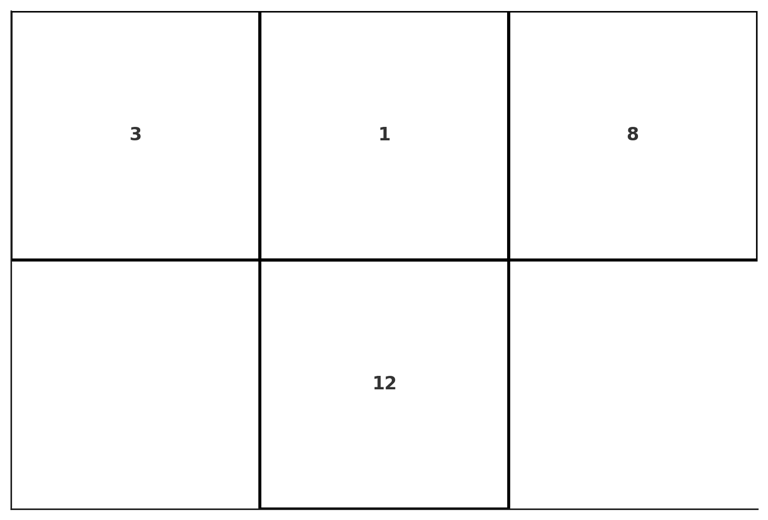
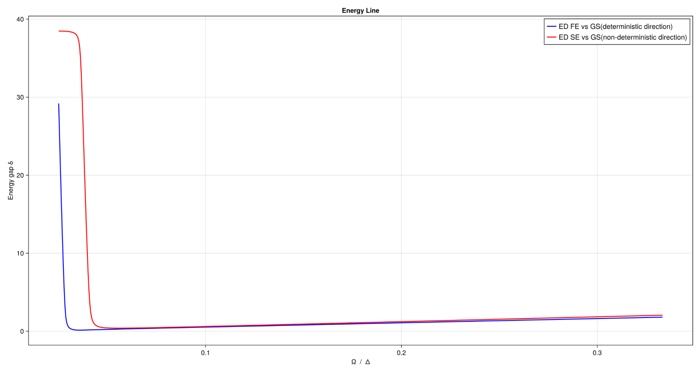
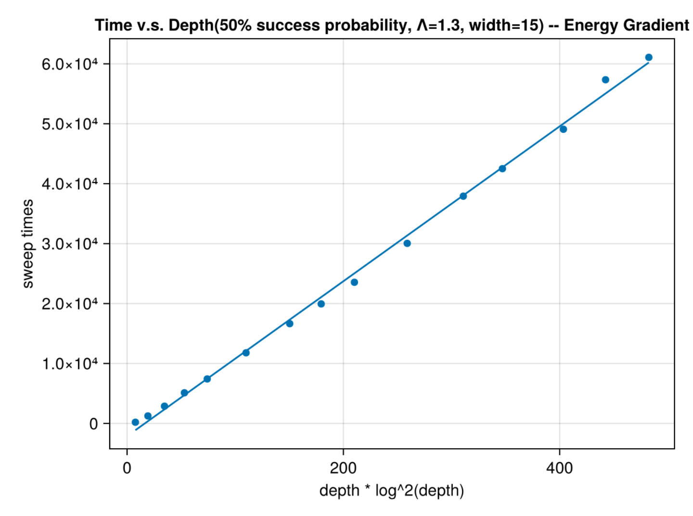
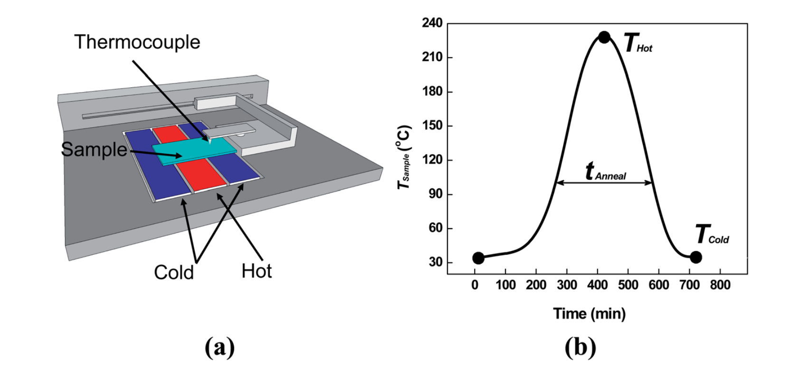
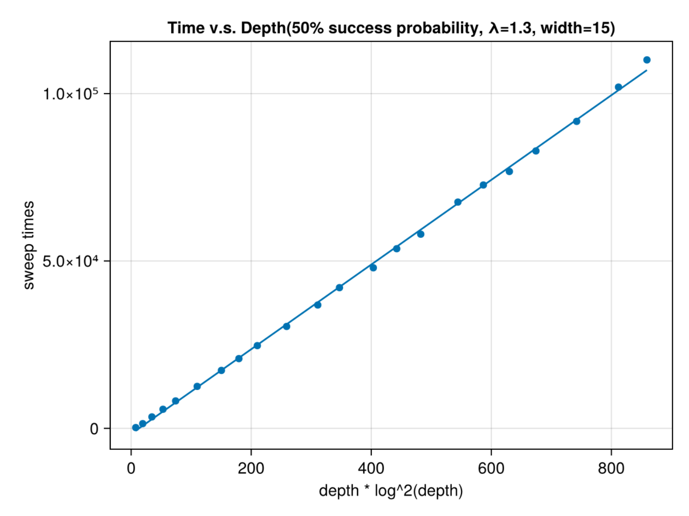

# Surface Programmable Materials

## Physical model: Rydberg atoms array

**Statement 1**: The classical part of Rydberg Hamiltonian encodes an independent set problem.

The Rydberg Hamiltonian[^Nguyen2023] is defined as
```math
    H_{\text{Ryd}} = \sum_v \dfrac{\Omega_v}{2} \sigma^x_v - \sum_v \Delta_v n_v + \sum_{v < w}  V_{\text{Ryd}}(|\overrightarrow{\mathbf{r}_v} - \overrightarrow{\mathbf{r}_w}|)n_v n_w.
```
where $\Omega_v$ is the Rabi frequency, $\Delta_v$ is the detuning, $n_v = \dfrac{1}{2}(1 - \sigma^z_v)$ is the number operator, and $V_{\text{Ryd}}(|\overrightarrow{\mathbf{r}_v} - \overrightarrow{\mathbf{r}_w}|) = C_6/|\overrightarrow{\mathbf{r}_v} - \overrightarrow{\mathbf{r}_w}|^6$ is the Rydberg interaction potential.

The classical part of which can be written as
```math
H_\text{MWIS} = -\sum_{v \in V}\delta_v n_v + \sum_{(u, v) \in E} U_{uv} n_u n_v.
```
The ground state of which encodes the maximum weight independent set (MWIS) problem.

> Wikipedia: In graph theory, a maximal independent set (MIS) or maximal stable set is an independent set that is not a subset of any other independent set. In other words, there is no vertex outside the independent set that may join it because it is maximal with respect to the independent set property.

**Statement 2**: Finding the ground state of the classical part of the Rydberg Hamiltonian is equivalent to finding the maximum weight independent set.

### Energy based universal computation with Rydberg atoms array
**Statement 3**: The classical Rydberg Hamiltonian is universal for classical computation.

The NOR gate can be implemented using the Rydberg Hamiltonian (subfigure c below). The NOR gate is a universal gate for classical computation.
{width=300}

The conjunction of gates can be implemented by "gluing" the Rydberg atoms together (subfigure d below). The weights are added together.

For more logic gates, please check the GitHub repository [UnitDiskMapping.jl](https://github.com/QuEraComputing/UnitDiskMapping.jl/blob/main/test/logicgates.jl).

### Cooling the Rydberg Hamiltonian

**Statement 4**: The Rydberg Hamiltonian, if cooled successfully with some vertices fixed to certain configuration, can be used to solve the circuit satisfiability problem, which is NP-complete.[^Moore2011]

$P \neq NP$: Cooling is generally hard, especially when from the non-deterministic direction.

## Surface Programmable Material

**Definition: (Surface programmable material)**: a lattice (with translational invariance) model that can be programmed on its surfaces to perform universal computation.

### Elementary cellular automaton

An elementary cellular automaton is a 1-dimensional cellular automaton[^wiki-1d-automaton] where there are two possible states (labeled by 0 and 1). The rule to determine the state of the cell in next generation depends only on the current state of the cell and its two immediate neighbors.

There are $8 = 2^3$ possible configurations for a cell and its two immediate neighbors. Different elementary cellular automaton are only different from their translation rules. There are only $2^8 = 256$ different rules, so do the automatons.

If we put each possible current configurations in order: 111, 110, ..., 001, 000, and put the resulting state under them. We then get an integer in its binary representations. Then this integer is taken to be the rule number of the automaton. For example, rule 110.

Given that $110_d = 01101110_2$, so rule 110 is defined by the translation rule:


|Current Pattern (L, C, R)| 111 | 110 | 101 | 100 | 011 | 010 | 001 | 000 |
| :------- |:-------:|:-------:|:-------:|:-------:|:-------:|:-------:|:-------:|:-------:|
| New State For Center Cell | 0 | 1 | 1 | 0 | 1 | 1 | 1 | 0 |

Rule 110 has been shown to be Turing Complete[^Cook2009], and thus capable of universal computation.

### The Rule 110 Gadget

We can encode the Rule 110 cellular automaton into a Weighted Maximum Independent Set Problem, with blue vertices assigned a weight of 1 and red vertices assigned a weight of 2, as follows.
{width=300}

This graph can be embedded into a grid graph, where two vertices are connected if and only if their Euclidean distance is no more than $2$.
{width=300}

The correspondence between the Maximum Weighted Independent Set (MWIS) Solution and Rule 110 is as follows: 

The states of vertex **1**, vertex **3**, and vertex **8** represent the states of the **middle**, **left**, and **right** cells of the automaton's **input**, respectively. If the input value of a cell is 1, then the corresponding vertex must be in the MWIS solution; otherwise, it is not. Vertex **12** corresponds to the automaton's **output**. If the automaton output is 1, then vertex 12 is in the MWIS solution; otherwise, it is not.

In the automaton diagram, the above gadget is equivalent to:

{width=300}

There are exactly **8** different MWIS solutions in this graph (the weighted size of each MWIS solution is 7), each corresponding to one of the **8** possible outputs of the automaton. We list them as follows.
{width=500}

### A 2D Surface Programmable Material

The gadget we constructed based on the Rule 110 cellular automaton naturally possesses Turing completeness. Therefore, it can be tiled in a two-dimensional plane to create a computational material with logical operation capabilities. Utilizing copy gadget and cross gadget[^Nguyen2023], we construct a **Surface Programmable Material** with open boundary conditions as follows.

{width=500}

The above gadget depicts a two-layer cellular automaton. The vertices in blue, red, green and black have weights of 1, 2, 3 and 4, respectively. In the automaton diagram, the above gadget is equivalent to:

{width=300}

One can easily verify that with this lattice-like structure, we can build infinitely large gadgets capable of universal computing in a surface. Thus we call it Surface Programmable Material.

## Deterministic and non-deterministic computation

Definitions:
* *in-surface/out-suface*: The surface of a surface programmable material that associated with the input/output of the logic circuit.
### Deterministic direction
The computation contains the following steps:
1. Initialize the in-surface configuration. By removing some atoms on the in-surface.
2. Connect the in-surface/out-surface to external heat sources at temperature $T_1 < T_2$, respectively. We also require that the energy gap between the ground state and the first excited state of the Hamiltonian to be $\Delta E< T_1$.
3. Lower the temperature of the heat sources "slowly" to cool the system to the ground state of the Hamiltonian. The temperature of the heat sources at time $t$ is $T_{1/2}(t) = T_{1/2}(0)\lambda^{-c t}$, where $T_{1/2}(0)$ is the initial temperature of the heat sources, and $\alpha$ is a constant.

## Speed and work

The trade-off between the energy consumption and the speed of computation[^Feynman2018]. To avoid confusion, we emphasize the "energy consumption" is defined as the work done in a computational process, which is the same as the amount of heat dissipated to the environment. This quantity has a lower bound given by the Landauer principle, which states that the work done in a computation is at least $kT\ln 2$ per bit erased[^Reeb2014].

Information erasure in the surface programmable material is proportional to the volume of the material, which is $O(tS)$, where $t$ is the time of computation, and $S$ is memory (proportional to the surface area) of the material.

From the chemical reaction perspective, the speed of computation is determined by the parameter $\lambda$.


### Non-deterministic direction
Solving the ground state of the Hamiltonian of the Surface Programmable Material is at least as hard as solving the circuit satisfiability problem, which is NP-complete[^Moore2011].

## Outlook: The emergence of wisdom


## Local cooling

We test the hypothesis: Cooling is easy if the process is from the deterministic direction, hard if the process is from the non-deterministic direction. 

In our gadget, cooling from deterministic direction is from input to output, non-deterministic direction is from output to input. The latter one must be non-deterministic because this gadget is Turing-Complete. 

The gadget is dominated by such hamiltonian, correspond to the classical part of Rydberg atoms.

$$
H = -\Delta \sum_i w_i \hat n_i + \sum_{|\vec r_i - \vec r_j|\leq 2} U \hat n_i \hat n_j
$$

Our target is to calculate the **state** with lowest energy under the above hamiltonian as quickly as possible, while some positions are set to be 1 or 0 in the **state**.

### Quantum adiabatic annealing energy gap

One possible way is to use quantum adiabatic annealing: start from a simple hamiltonian $H(0)$ and its simple ground state $|\psi(0)\rang$, then gradually change the parameters until reaching the desire hamiltonian $H(t)$.

More specifically, set $\Delta(t=0) <0$ and $\Omega(t=0) =0$ initially, then first turning on $\Omega(t)$ to a non-zero value, sweeping $\Delta(t)$ to final value, and finally turning off $\Omega(t)$.

$$
H_{QAA}(t) = \sum_{v\in V} (-\Delta(t)w_v \hat n_v + \Omega(t)\sigma_{v}^x) + \sum_{(u,w) \in E} U\hat n_u \hat n_w
$$

If the time evolution is sufficiently slow, then by the adiabatic theorem, the system follows the instantaneous ground state, ending up in the solution to the MWIS problem[^Pichler2018].Then we only need to evalute the minimum energy gap $\Delta_{QAA}$ between the ground and first-excited states of instantaneous hamiltonian. 

We set $\Omega = 1 \times 2\pi$ and sweep the $\Delta$ from $3 \times 2\pi $ to $40 \times 2\pi$ with 1*1 gadget. For deterministic direction, we simply set the weight of the input vertices to $50$; as for non-deterministic direction, we set the weight of the output vertice to $50$.

Result listed as follows. **However, we didn't see cooling from deterministic direction would give a smaller energy gap than the other direction. We think that's because the size of this gadget is too small.**

{width=500}

### Local cooling test through simulated annealing

We will refer to a toy-model limit: $\Delta = 1$ and $U = \infty$. What's more, we introduced **"Energy Gradient"** to the gadget to provide directionality for the simulated annealing. The hamiltonian for a m-layers automaton now change the form into:

$$
H = \sum_{|\vec r_i - \vec r_j|\leq 2} U \hat n_i \hat n_j  - \Delta \sum_{i,k|\text{vertice i belongs to layer k}} w_i \lambda^{m-k} \hat n_i
$$

The last term of our new hamiltonian represent the **"Energy Gradient"**. For vertice $i$ in the k-th layer along the computation direction, we reset its weight to $w_i\lambda^{m-k}$. 

From an intuitive perspective, for layers where the thermal energy exceeds the energy required to flip the nodes in the current layer, simulated annealing always filps them randomly; for layers where the thermal energy is lower than the energy required to flip the nodes in the current layer, simulated annealing tends to maintain their configuration; for layers where the thermal energy is just comparable to the flipping energy, simulated annealing executes the corresponding cooling process.

Hence, we can simply set the discrete annealing tempretures as $T(k) = T_0 \eta^k$, where $\eta < 1$ and $\eta ^R = \lambda$. Here $R$ represent the number of the cooling iterations performed for a given layer.

Similar to what we did in QAA, firstly, we set the weights of the inputs/outputs vertices to $\infty$ (NOTE: by removing vertices) for testing doing computation along deterministic direction/non-deterministic direction. Then we compare the probability of successfully finding the corresponding ground state under certain $T_0, R, \lambda$ and $\eta$. **We find that doing computation along the non-deterministic direction is harder than the other one**

Next, we believe that for each layers's cooling process, we are essentially calculating a probability transition matrix $P(T,k)$, where $P(T,k)_{outputm, inputm}$ represent the probability that, given the input vertices state is $inputm$, the cooling process sets the output vertices state to $outputm$. 

Thanks to the translational invariant structure of our gadget and cooling process, we believe the matrix $P(T,k)$ is independent from $T$ and $k$, which give us an intuitation that if the failure probability of each layer's cooling process is $F$, the total success probability is $(1-F)^m$. **We test this in a 4-single-gadget per layer automaton and find this suit well.**

Finally, we evaluate the error probability v.s. run time in a single layer 4-gadget automaton. Result listed as follows.


## Estimation of the computing time
Let the temperature of the $k$-th layer at time $t$ be $T(t, k) = T \lambda^{ct + k}$ (**NOTE: should be $T(t, k) = T\lambda^{ct-k}$? Otherwise temperature would decrease with increasing depth, and the deepest layer cools first**), where $T$ is the initial temperature, $c$ is a constant, and $\lambda < 1$ is a constant.
At any given time $t$, we denote the subset of atoms at depth $-\frac{W}{2} < ct + k < \frac{W}{2}$ as the **active zone**, where $W$ is the width of the sliding window such that $e^{-\Delta E_{max} /\lambda^{W/2}} = \epsilon \ll 1$. The active zone is the region where non-trivial computation occurs. The atoms outside the active zone are either frozen or completely randomized. Clearly, $W$ asymptotically scales as $(1-\lambda)^{-1} \log(-\frac{1}{\log\epsilon})$ (NOTE:$W \sim \log_{\lambda}(-\frac{1}{\log{\epsilon}}) = \frac{\log(-\frac{1}{\log{\epsilon}})}{\log(\lambda)} \approx (1 - \lambda)^{-1}\log(-\frac{1}{\log \epsilon})$, the last term exists when $\lambda \lessapprox 1$).

We consider thermalizing the system in units of $W$(**NOTE: should be $\frac{m}{W}?$**) time steps. $\epsilon$ is the error probability of each unit of time, which should scale as $\epsilon \sim\left(\frac{m}{W}\right)^{-1}$, where $m$ is the total number of time steps.

The probability transition matrix of the active zone at any given time $t$ (except the starting and ending time) is the same, so we denote it as $P = P(t)$. The error tolerance requires the zone to be thermalized to certain extent, i.e. $\left(\frac{\lambda_2(P)}{\lambda_1(P)}\right)^{t_{\text{th}}} < \epsilon$, where $\lambda_1(P) \geq \lambda_2(P)$ are the two largest eigenvalues of $P$. We have $t_{\text{th}} \sim \left(1-\frac{\lambda_2(P)}{\lambda_1(P)}\right)^{-1}\log(\epsilon^{-1})$.

Under the assumption that $\left(1-\frac{\lambda_2(P)}{\lambda_1(P)}\right)\sim e^{-W}$, we have $t_{\text{th}} \sim e^{(1-\lambda)^{-1}}\log^2(\epsilon^{-1})$. The total time for the computation is $t_{\text{total}} \sim \left(\frac{m}{W}\right)\log^2(\frac{m}{W}) e^{(1-\lambda)^{-1}}$. 

### Temperature gradient and Energy gradient

Temperature gradient and energy gradient is indeed equal. One can simply make the following modification to the transition probability in the markov process and find the equality.

$$e^{-\frac{\Delta E_k}{T\lambda^{ct+k}}} = e^{-\frac{\Delta E_k(\frac{1}{\lambda})^k}{T\lambda^{ct}}} = e^{-\frac{\Delta E_k \Lambda^k}{T(t)}}$$

The time complexity in $\Lambda$ form is apparently $T_{total} \sim \frac{m}{W}\log^2(\frac{m}{W})e^{(\Lambda-1)^{-1}}$

The reason that we did this transform is that classical simulated annealing could only generate heat-equilibrilium Boltzmann Distribution, where the temperature must remain invariant across space.

Time per computation scales as $E \sim \log^2 \frac{m}{W}$.

### Numerical result

To determine large-scale effect, we mainly focus on a simple toy model
$$
H = \sum_{\text{each gadget}} [\text{gadget is not satisfied}]
$$

We conducted numerical experiments under the condition $\Lambda = 1.3, n = 15$, and fitted each sweep time against $m \log^2(m)$. Where $m$ represents the number of the single layers, $n$ represents the width per single layer.



### Discussion about the model

One should notice that we used a important hypothesis that $(1-\frac{\lambda_2}{\lambda_1}) \sim e^{-W}$, which means that the spectral gap of the transition matrix has nothing to do with the width of a single layer. Should this exists? (**NOTE: should do some numerical experiments**)

## Algorithm beyond temperature gradient

Applying a huge energy gradient or temperature gradient to this material seems not a good idea when the system become larger.

Inspired by the way clothes are ironed, we conceived the idea of slowly scanning a wave-shaped temperature curve from one end to the other. This method is widely used in studying the heating-recrystallization properties of real materials[^zhang2014]. 



There are various specific choices for the wave packet, such as power-law, exponential, and others. In this context, we primarily focus on a exponential wave packet, which can be directly linked to the concept of temperature gradient.

A expoential wave packet with central position $middle(t)$, amplitude $A$ and base $\Lambda$,  can be express as following.

$$
T(k,t) = A\Lambda^{|k-middle(t)|}
$$

So slowly moving the wave packet means slowly changing $middle(t)$

Let's review the concept **active zone** defined earlier. When the temperature of the system is defined as $T_{tg}(k, t) = T\lambda^{ct-k}$, atoms in the active zone are those whose layer $k$ belongs to $k<ct - \frac{W}{2}$, where $W$ are given by $e^{-\frac{\Delta E_{max}}{\lambda^{\frac{W}{2}}}}\leq \epsilon$. For those $k<ct - \frac{W}{2}$, the probability that SA would flip an atom's state is no more than $e^{-\frac{\Delta E_{max}}{T\lambda^{ct}\lambda^{-ct + \frac{W}{2}}}}=e^{-\frac{\Delta E_{max}}{T\lambda^{\frac{W}{2}}}}\leq \epsilon^{\frac{1}{T}}$, which means these previous layer would stay "frozen". For those layer much deeper than $k = ct$, SA would just randomly flip them. These layer won't affect layers in active zone.

Now turn our sight into the wave packet model, we can construct a similar concept **heat zone**. Layers in the heat zone are those $A\lambda^{|k-middle(t)|}\ge \epsilon\rightarrow middle(t) + \frac{\log(\epsilon)}{\log(\Lambda)}< k < middle(t) - \frac{\log(\epsilon)}{\log(\Lambda)}$. 

The layers that shallower than $middle(t) + \frac{\log(\epsilon)}{\log(\Lambda)}$ correspond to layers shallower than $ct-\frac{W}{2}$ in temperature gradient model, since they are both stay "frozen"; layers between $middle(t) +\frac{\log(\epsilon)}{\log(\Lambda)}$ and $middle(t)$ are effectively cooled down, which correspond to the **active zone**; layers deeper than $middle(t)$ are either randomly fliped or stay "frozen", but we don't care their state.

Therefore, the wave packet model are just the same as the temperature gradient model, and is more likely to be realized physically.

We also conducted a numerical simulation on the wave packet model with the same condition $\Lambda = 1.3$ and $width = 15$ and fitted the sweep time against $m\log^2(m)$. Result is listed as follows.



### Some details about non-equilibrium simulated annealing

The classical simulated annealing can only deal with the situation that the temperature is space-invariant. Although there are many ways to simulated a real-world system with temperature gradient, such as Molecular Dynamics[^bai2015] [^Deng2006], but these methods mainly depend on dynamically adjusting the atomic velocities to achieve a temperature gradient, which can't be directly used in our model.

There are also Monte Carlo-based methods to simulate a moving temperature wave packet that facilitates material growth[^Godfrey1995] [^Tan2017]. However, these methods fail to establish a direct connection between the simulated temperature and experimental temperature[^Zollner2014].Therefore, based on HeatBath acceptance rule, we made a slight modification to the classical SA model.

When we flip one atom's state, there would be some energy difference $\Delta E_{i}$ in field $i$ with temperature $T_i$. The probability to accept this flip would be

$$
P = \frac{1}{1 + e^{\sum_i \frac{\Delta E_i}{T_i}}}
$$

It is easily to observe that when the system returns to heat-equilibrium, the probability reverts to the classical HeatBath acceptance probability.

## Classical Dynamics

To examine whether this model could achieve a better performance when using adiabatic methods, we need to generalize this energy function to some good hamiltonian. There has already been work on mapping combinatorial optimization problems to a spin-glass model (known as the Ising Machine) and leveraging the properties of digital devices that simulate this Ising Machine to find an appropriate ground state, which encodes computational information[^Aadit2022] [^Bybee2023].

A spin-glass hamiltonian is described as follows.

$$
H = \sum_{u,v \in E} J_{u,v}s_us_v + \sum_{i\in V}h_i s_i
$$

where $h_i$ is onsite energy, $J_{u,v}$ is interaction energy and $s_i \in \{-1, 1\}$ is local spin. The mapped spin-glass model should possess propertys that it has exactly 8 ground states, each correspond to one input-output relation in Cellular Automata.


To map our toy model $H = \sum_{\text{each gadget}} [\text{gadget is not satisfied}]
$ to spin-glass model, we used Linear Programming algorithm.

### Use linear programming to map model

Linear problems are problems that can be express in standard form as
$$
\min_{x \in \mathbb{R}^n} \sum_{i=1}^n c_ix_i\\
\text{s.t. } l_j \leq \sum_{i=1}^n a_{i,j}x_i \leq u_j, j=1...m\\
p_i \leq x_i \leq q_i, i=1...n
$$

Here with a spin-glass consists $N$ atoms, we choose $n$ to be $\frac{N(N-1)}{2} + N$, which means each variable $x_i$ represents a correspond interaction energy $J_{u, v}$ or a correspond onsite energy $h_u$, we assigned aliases to these $x_i$ as $x_{u,v}$ or $x_{u}$.

Then we assign a corresponding spin state to each input-output relationship. Let these states be $st[1...8]$ and the others be $st[9...2^N]$. We need to construct constraints that $E(st[1])=E(st[2])=...=E(st[8])$ and $E(st[1])<E(st[9]),E(st[10]), ..., E(st[2^N])$, where $E(st[i])$ represents the energy of state $st[i]$.

For $E(st[1])=E(st[2])$, we could add one constraint that 
$$
\sum_{u,v}x_{u, v} st[1,u]st[1,v] + \sum_{u}x_ust[1,u]\leq \sum_{u,v}x_{u, v} st[2,u]st[2,v] + \sum_{u}x_ust[2,u] \\
\sum_{u,v}x_{u, v} st[2,u]st[2,v] + \sum_{u}x_ust[2,u]\leq \sum_{u,v}x_{u, v} st[1,u]st[1,v] + \sum_{u}x_ust[1,u] 
$$

As for $E(st[1])< E(st[j>8])$, the constraint should be
$$
\sum_{u,v}x_{u, v} st[1,u]st[1,v] + \sum_{u}x_ust[1,u]\leq \sum_{u,v}x_{u, v} st[j,u]st[j,v] + \sum_{u}x_ust[j,u] +\delta \\
$$

These constraints can be easily change into standard form. Also, one should notice that we add a small term $\delta$ in the second type of constraints since LP can't handle inequalities without equality constraints. 

The result is that our toy model can be successfully mapped into a 5-atoms spin-glass model, one of which is ancilla. And there is no solution with 4-atoms spin-glass mapping.

### Numerical result

We firstly tried classical adiabatic annealing with the classical-spin mapping method[^Wang2013]. Here the quantum spin $s_i$ are replaced by a classical unit magnetic vector $\vec{M_i}$, with the equation of motion

$$
\frac{\partial \vec M_i}{\partial t} = \vec M_{i} \times \vec H_{i}(t)
$$

where

$$
\vec H_i(t) = -\frac{\partial H(t)}{\partial \vec M_i} 
$$

Here the hamiltonian of the system is

$$
H(t) = \frac{t}{T}(\sum_{u,v}J_{u,v} M_{u,z}M_{v,z} + \sum_{u} h_u M_{u, z}) + (1-\frac{t}{T})(I\sum_{u}M_{u,x})
$$

The former term is the generally increasing target hamiltonian, the latter term is a generally decreasing known Ising-transverse field. We can explicitly write out the effective magnetic field.

$$
\vec H_{i}(t) = -\frac{t}{T}(\sum_{v}J_{i, v}M_{v,z} + h_i)\hat e_z - (1-\frac{t}{T})I\hat e_x
$$

Integrate the ordinary differential equation then we get the  classical dynamics of this spin-glass model. However, result shows that it is extremely hard to find the solution when the number of layers exceed $4$ (input layer is pinned). 

The reason maybe that the mapped spin-glass model lies in the hard region in [^Wang2013]. Because every interaction energy is positive, which gives rise to strong frustration. Results in [^Wang2013] also shows that even in random spin-glass model, there exist hard instance that can't be solve.

## References

[^wiki-1d-automaton]: https://en.wikipedia.org/wiki/Elementary_cellular_automaton 

[^Cook2009]: Cook, M. (2009). A Concrete View of Rule 110 Computation. Electronic Proceedings in Theoretical Computer Science, 1, 31–55. https://doi.org/10.4204/EPTCS.1.4 

[^Nguyen2023]: Nguyen, M.-T., Liu, J.-G., Wurtz, J., Lukin, M. D., Wang, S.-T., & Pichler, H. (2023). Quantum Optimization with Arbitrary Connectivity Using Rydberg Atom Arrays. PRX Quantum, 4(1), 010316. https://doi.org/10.1103/PRXQuantum.4.010316

[^Feynman2018]: Feynman, Richard P. Feynman lectures on computation. CRC Press, 2018.

[^Moore2011]: Moore, Cristopher, and Stephan Mertens. The nature of computation. OUP Oxford, 2011.

[^Reeb2014]: Reeb, D. & Wolf, M. M. An improved Landauer principle with finite-size corrections. New Journal of Physics 16, 1–34 (2014).

[^Pichler2018]: Pichler, H., Wang, S.-T., Zhou, L., Choi, S., & Lukin, M. D. (2018). Quantum Optimization for Maximum Independent Set Using Rydberg Atom Arrays (arXiv:1808.10816). arXiv. http://arxiv.org/abs/1808.10816

[^zhang2014]: Zhang, X., Yager, K. G., Douglas, J. F., & Karim, A. (2014). Suppression of target patterns in domain aligned cold-zone annealed block copolymer films with immobilized film-spanning nanoparticles. Soft matter, 10(20), 3656-3666.

[^bai2015]: Bai, X. M., Zhang, Y., & Tonks, M. R. (2015). Testing thermal gradient driving force for grain boundary migration using molecular dynamics simulations. Acta materialia, 85, 95-106.

[^Deng2006]: Deng, D., & Murakawa, H. (2006). Numerical simulation of temperature field and residual stress in multi-pass welds in stainless steel pipe and comparison with experimental measurements. Computational materials science, 37(3), 269-277.

[^Godfrey1995]: Godfrey, A. W., & Martin, J. W. (1995). Some Monte Carlo studies of grain growth in a temperature gradient. Philosophical Magazine A, 72(3), 737-749.

[^Tan2017]: Tan, Y., Maniatty, A. M., Zheng, C., & Wen, J. T. (2017). Monte Carlo grain growth modeling with local temperature gradients. Modelling and Simulation in Materials Science and Engineering, 25(6), 065003.

[^Zollner2014]: Zöllner, D. (2014). A new point of view to determine the simulation temperature for the Potts model simulation of grain growth. Computational materials science, 86, 99-107.

[^Aadit2022]: Aadit, N. A., Grimaldi, A., Carpentieri, M., Theogarajan, L., Martinis, J. M., Finocchio, G., & Camsari, K. Y. (2022). Massively parallel probabilistic computing with sparse Ising machines. Nature Electronics, 5(7), 460-468.

[^Bybee2023]: Bybee, C., Kleyko, D., Nikonov, D. E., Khosrowshahi, A., Olshausen, B. A., & Sommer, F. T. (2023). Efficient optimization with higher-order Ising machines. Nature Communications, 14(1), 6033.

[^Wang2013]: Wang, L., Rønnow, T. F., Boixo, S., Isakov, S. V., Wang, Z., Wecker, D., ... & Troyer, M. (2013). Comment on:" Classical signature of quantum annealing". arXiv preprint arXiv:1305.5837.