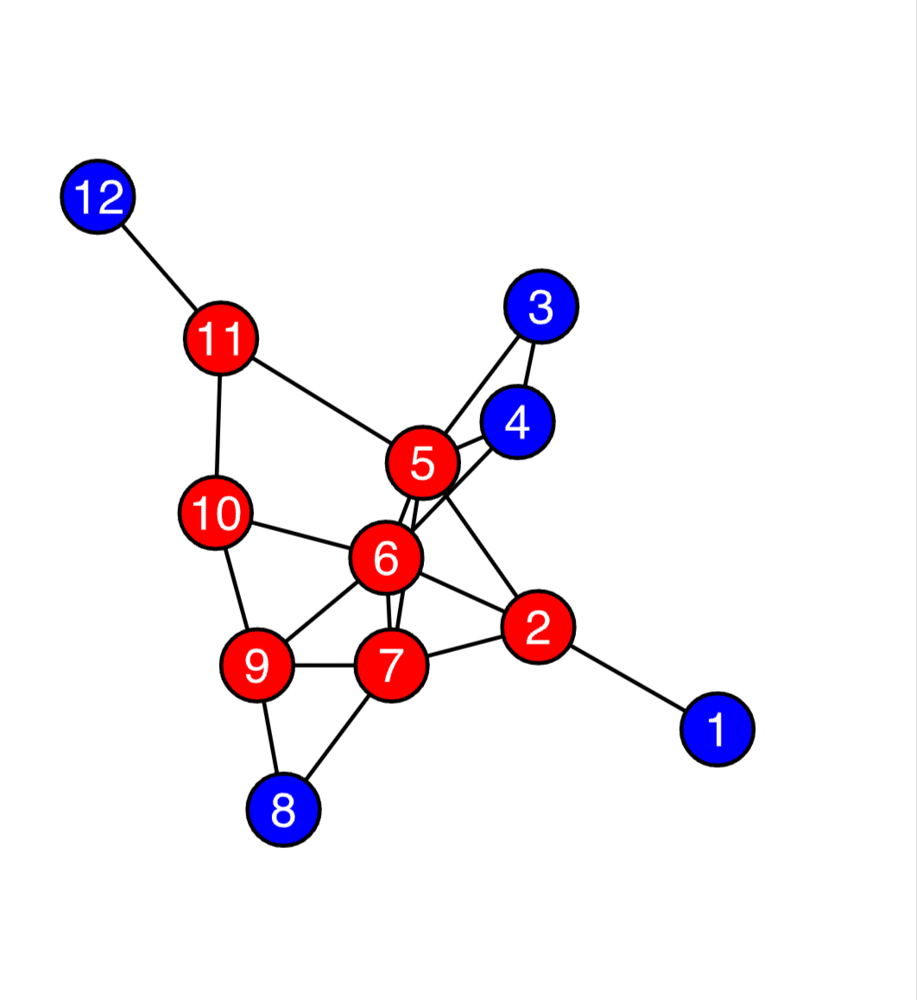
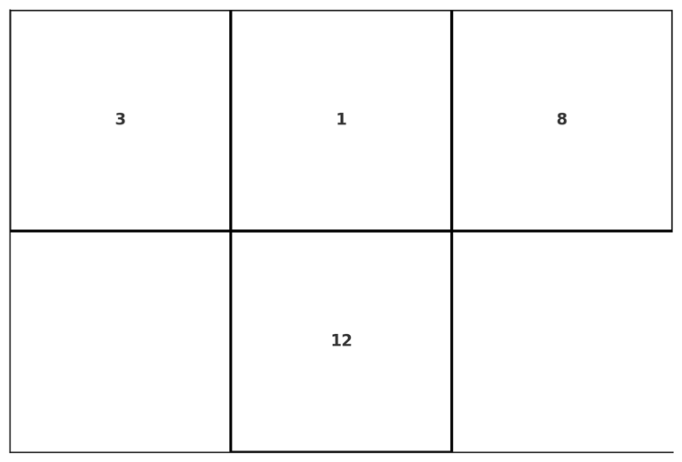
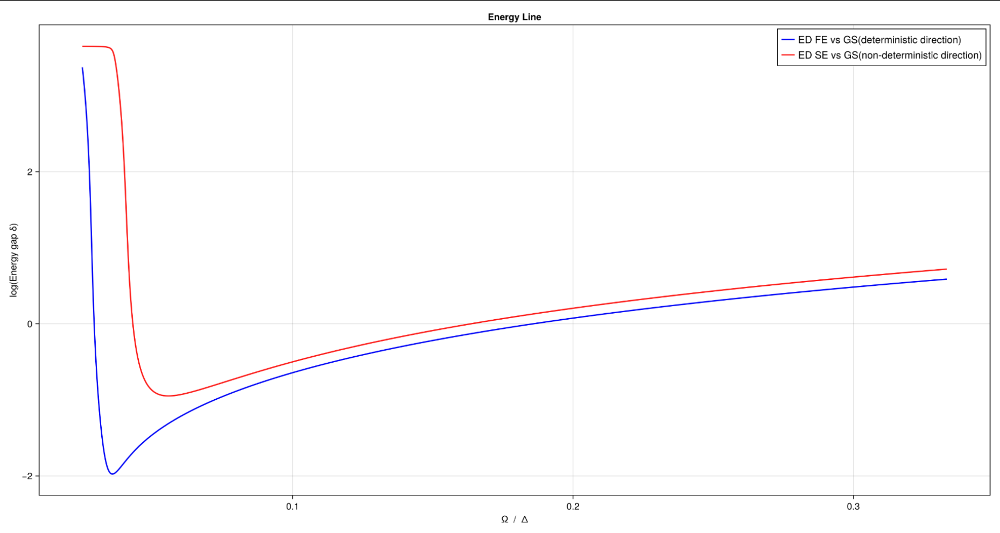

# Surface Programmable Material

---

### Rydberg atoms array

The Rydberg Hamiltonian is defined as
    $$    
    H_{ryd} = \sum_{v} \frac{\Omega_v}{2}\sigma_v^x - \sum_v \Delta_v \hat n_v + \sum_{v < w}V_{ryd}(|\vec r_v - \vec r_w|)\hat n_v\hat n_w
    $$
- $\Omega_v$ : Rabi frequency
- $\Delta_v$ : Detuning
- $n_v = \dfrac{1}{2}(1 - \sigma^z_v)$ : Number operator, 
- $V_{\text{Ryd}}(|\overrightarrow{\mathbf{r}_v} - \overrightarrow{\mathbf{r}_w}|) = C_6/|\overrightarrow{\mathbf{r}_v} - \overrightarrow{\mathbf{r}_w}|^6$ : Rydberg interaction potential.

---

### Classical Part

$$
H_\text{MWIS} = -\sum_{v \in V}\delta_v n_v + \sum_{(u, v) \in E} U_{uv} n_u n_v.
$$

The ground state of which encodes the maximum weight independent set (MWIS) problem.

> Finding the ground state of the classical part of the Rydberg Hamiltonian is equivalent to finding the maximum weight independent set.

---

### Energy Based Computation with Rydberg atoms

{width=500}

- NOR gate: Fig.c
- "Gluing Together" : Fig.d
- NOT gate: Fig.a

---

### Energy Based Computation with Rydberg atoms

NOR gate is universal. 

With Copy gates(2 NOT gates gluing together), can be shown that rydberg atoms computation is universal.

---

### Cooling the Rydberg Hamiltonian

The Rydberg Hamiltonian, if cooled successfully with some vertices fixed to certain configuration, can be used to solve the circuit satisfiability problem, which is NP-complete.

**Guess**: 
> $P \neq NP$: Cooling is generally hard, especially when from the non-deterministic direction.

---

### Surface Programmable Material

**Definition: (Surface programmable material)**: 
> a lattice (with translational invariance) model that can be programmed on its surfaces to perform universal computation.

---

### Elementary cellular automaton

- Each cellular only has 2 states(0 and 1)

- The state of the next generation of current cell,  only depends on current state of the cell and its two immediate neighbors.

- $8 = 2^3$ possible configurations of the three cells

- $256 = 2^8$ different automatons.

---

### Transfrom rule 110

|Current| 111 | 110 | 101 | 100 | 011 | 010 | 001 | 000 |
| :------- |:-------:|:-------:|:-------:|:-------:|:-------:|:-------:|:-------:|:-------:|
| New  | 0 | 1 | 1 | 0 | 1 | 1 | 1 | 0 |

- Rule 110 has been proved to be universal for computation

---

### Rule 110 Gadget

Encoded Rule 110 automaton into a Weighted Maximum Independent Set Problem

{width=400}

- Blue vertices: Weight = 1
- Red vertices: Weights = 2

---

### Rule 110 Gadget

Enbedded this graph into a grid graph

{height=300, width=250}

- Connected Rule: Distance no more than 2
- Left input: Vertex 3
- Central input: Vertex 1
- Right input: Vertex 8
- Output: Vertex 12

---

### Rule 110 Gadget

{width=250}

Can be represented in automaton form:

{width=300}

---

### Rule 110 Gadget solution space

{width=500}

- Exact 8 solutions, corresponding to 8 different input

---

### 2D Surface Programmable Material

{width=500}

- Constructed with Rule 110 gadget and Copy gadget.
- Blue, Red, Green and Black : Weights of 1, 2, 3 and 4

---

### 2D Surface Programmable Material

Represented in automaton form:

{width=300}

---

### Deterministic and non-deterministic computation

Definitions:
* *in-surface/out-suface*: The surface of a surface programmable material that associated with the input/output of the logic circuit.

---

### Deterministic direction
The computation contains the following steps:
1. Initialize the in-surface configuration. By removing some atoms on the in-surface.
2. Connect the in-surface/out-surface to external heat sources at temperature $T_1 < T_2$, respectively. We also require that the energy gap between the ground state and the first excited state of the Hamiltonian to be $\Delta E< T_1$.
3. Lower the temperature of the heat sources "slowly" to cool the system to the ground state of the Hamiltonian. The temperature of the heat sources at time $t$ is $T_{1/2}(t) = T_{1/2}(0)\lambda^{-c t}$, where $T_{1/2}(0)$ is the initial temperature of the heat sources, and $\alpha$ is a constant.

---

### Quantum Adiabatic Annealing

$$
H_{QAA}(t) = \sum_{v\in V} (-\Delta(t)w_v \hat n_v + \Omega(t)\sigma_{v}^x) + \sum_{(u,w) \in E} U\hat n_u \hat n_w
$$

- Set $\Omega = 1 \times 2\pi$ and sweep the $\Delta$ from $3 \times 2\pi $ to $40 \times 2\pi$ with 1*1 gadget. 
- For deterministic direction, simply set the weight of the input vertices to $50$ 
- For non-deterministic direction, we set the weight of the output vertice to $50$.

---

### Energy Gap

{width=800}

- Blue line: Deterministic
- Red line: Non-deterministic

**Didn't see deterministic better than non-deterministic. Maybe the size is too small?**

---

### Simulated Annealing

- Toy-model limit: $\Delta = 1$ and $U = \infty$. 
- Introduced **"Energy Gradient"** to the gadget to provide directionality for the simulated annealing. 

$$
H = \sum_{|\vec r_i - \vec r_j|\leq 2} U \hat n_i \hat n_j  - \Delta \sum_{i,k|\text{vertice i belongs to layer k}} w_i \lambda^{m-k} \hat n_i
$$

- Last term of our new hamiltonian represent the **"Energy Gradient"**. 

- For vertice $i$ in the k-th layer along the computation direction, we reset its weight to $w_i\lambda^{m-k}$. 

---

### Simulated Annealing

"**What will SA do?**"
- Thermal energy $>$ Frustration energy: Flips them randomly 
- Thermal energy $<$ Frustration energy: Maintains their configuations
- Thermal energy $\approx$ Frustration energy: Executes the corresponding cooling process.

---

### Simulated Annealing

Hence:

$$
E_{max, nextlayer} \ll E_{min, previous layer}
$$

or

$$
\frac{E_{min, previous}}{E_{max, next}} = \lambda \gg 1
$$

led to exp-like energy gradient

---

### Simulated Annealing
"**What we do in per layer?**"

SA is a markov procress 
- stable distribution

How fast will the SA converge to stable distribution?
- Transition matrix gap

---

### Simulated Annealing

- Single layer, 4 gadgets.

---

### Toy model

Unable to perform larger scale simulation.

Turn into a similar toy model (Translation invariant, Rule 110).

$$
H = \sum_{\text{each gadget}} [\text{gadget is not satisfied}]
$$

Tested some SA properties, firstly go with single layer properties.

---

### Energy gap v.s. Average field(Open)

- Single layer energy gap V.S. average field (use ED)

{width=700}

- Width = 9, added on-site energy to control input

---

### Energy gap v.s. Average field(Period)

{width=700}

- Period Boundary Condition, width=8

---

### Energy gap v.s. Width

- Single layer energy gap V.S. width (use ED)

{width=600}

- $$\Delta \propto w^{-1}$$

---

### Slope V.S. Average field 

- Then we test the slope V.S. average field(used to pin input) (use ED)

{width=600}

- Open Boundary Condition

---

### Slope V.S. Average field

{width=600}

- Period Boundary Condition

---

### Toy model

Conclusion:

The annealing time and the model's width is in linear relation ship

---

### Toy model

- Now it's the time to find the relation ship between annealing time and other parameters

- For a model with given width, depth, energy gradient, use the annealing time that success probability is 50% to be the cooling time

---

### Annealing time v.s. Depth(big gradient)

{width=600}

- With bigger $\lambda$, the annealing time seems to be linear with depth (desired)

---

### Annealing time v.s. Depth(small gradient)

- However, in smaller $\lambda$ situation, the relation ship seems to be quadratic.

{width=600}

---

### Annealing time v.s. Energy gradient

- Now try to describe the relationship between annealing time and energy gradient

- With bigger energy gradient, SA will only cool down single layer each time.

- Smaller energy gradient? -> We need expand the width of the "being cooled down layer" -> Call it "Combined layer"

---

### Annealing time v.s. Energy gradient

- Assume the width of the "Combined layer" is $W$

- Cooling this "Combined layer" need $e^W$ time

- $\frac{n}{W}$ "Combined layer" in total

- Should takes $T \propto \frac{n}{W}e^{W}$ form

- $\lambda ^ W = 2$ -> $W \propto \frac{1}{\log(\lambda)}$

- $T \propto \log(\lambda)e^{\frac{1}{\log(\lambda)}}$

---

### Annealing time v.s. Energy gradient

{width=600}

- Width = 10, Depth = 10

- Fitted not bad?